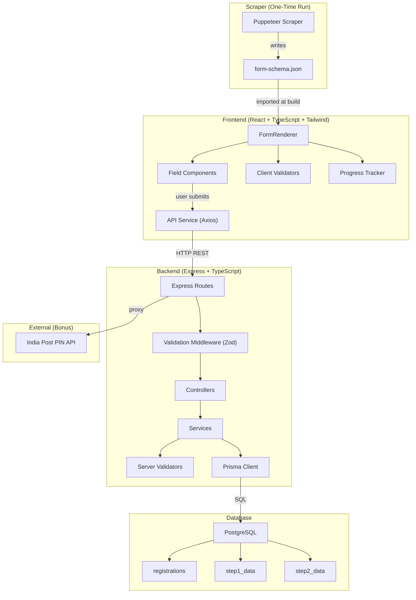

# Udyam Registration Portal — Project Planning Document

## Assignment Overview

Build the first two steps of the Udyam Registration Portal. The project involves:

1. **Scraping** the first two steps of the official Udyam Registration website to extract form structure (labels, inputs, buttons, dropdowns, validation rules) and saving them as a reusable JSON schema.
2. **Building a responsive frontend** (React + TypeScript + Tailwind CSS) that dynamically renders forms from the scraped JSON with real-time validation.
3. **Building a backend** (Node.js + Express + Prisma + PostgreSQL) to validate, receive, and store form submissions via REST APIs.
4. **Testing** with Jest (PAN validation, Aadhaar validation, API endpoints).
5. **Bonus features**: PIN code auto-fill, progress tracker, Docker, deployment.

---

## 1. Module Breakdown

### Module 1 — Scraper

| Attribute | Detail |
|-----------|--------|
| **Purpose** | Visit the Udyam Registration website using a headless browser, navigate the first two steps, extract every form element (labels, inputs, buttons, dropdowns, validation rules, form structure), and output a structured JSON schema file. |
| **Key Responsibility** | Single-run utility that produces `form-schema.json` consumed by the frontend and backend. |

### Module 2 — Frontend

| Attribute | Detail |
|-----------|--------|
| **Purpose** | Provide a mobile-first, responsive UI that reads the scraped JSON schema and dynamically renders the registration form for Step 1 and Step 2. |
| **Key Responsibility** | Dynamic form rendering, real-time client-side validation, progress tracking between steps, and submission of data to the backend API. |

### Module 3 — Backend

| Attribute | Detail |
|-----------|--------|
| **Purpose** | Expose REST API endpoints to accept form submissions, apply server-side validation (mirroring the rules from the JSON schema), and persist data to PostgreSQL via Prisma ORM. |
| **Key Responsibility** | Data validation, business logic, database operations, error handling, and API responses. |

### Module 4 — Database

| Attribute | Detail |
|-----------|--------|
| **Purpose** | Store all registration submissions, step-wise data, and metadata (timestamps, status). |
| **Key Responsibility** | Data persistence, referential integrity, and query performance through proper indexing. |

### Module 5 — Testing

| Attribute | Detail |
|-----------|--------|
| **Purpose** | Ensure correctness of PAN/Aadhaar validation logic and API endpoint behaviour using automated Jest test suites. |
| **Key Responsibility** | Unit tests for validators, integration tests for API routes. |

### Module 6 — DevOps / Deployment (Bonus)

| Attribute | Detail |
|-----------|--------|
| **Purpose** | Containerize all services with Docker and provide deployment configurations. |
| **Key Responsibility** | Docker Compose orchestration, environment management, optional CI/CD pipeline. |

---

## 2. Folder Structure

```
udyam-registration/
├── scrapper/                        # Scraper module
│   ├── src/
│   │   ├── index.ts                 # Entry point — orchestrates scraping
│   │   ├── browser.ts               # Headless browser setup & teardown
│   │   ├── extractors/
│   │   │   ├── step1.ts             # Extractor for Step 1 form elements
│   │   │   └── step2.ts             # Extractor for Step 2 form elements
│   │   └── utils/
│   │       └── schema-builder.ts    # Transforms raw DOM data → JSON schema
│   ├── output/
│   │   └── form-schema.json         # Generated JSON schema (committed)
│   ├── package.json
│   └── tsconfig.json
│
├── frontend/                        # Frontend module
│   ├── public/
│   │   └── index.html
│   ├── src/
│   │   ├── main.tsx                 # App entry point
│   │   ├── App.tsx                  # Root component with routing
│   │   ├── components/
│   │   │   ├── FormRenderer/
│   │   │   │   ├── FormRenderer.tsx       # Reads JSON schema, renders fields
│   │   │   │   ├── FieldFactory.tsx       # Maps field type → component
│   │   │   │   └── FormRenderer.test.tsx
│   │   │   ├── fields/
│   │   │   │   ├── TextInput.tsx
│   │   │   │   ├── SelectDropdown.tsx
│   │   │   │   ├── RadioGroup.tsx
│   │   │   │   ├── CheckboxField.tsx
│   │   │   │   └── DatePicker.tsx
│   │   │   ├── ProgressTracker/
│   │   │   │   └── ProgressTracker.tsx
│   │   │   └── common/
│   │   │       ├── Button.tsx
│   │   │       ├── ErrorMessage.tsx
│   │   │       └── Loader.tsx
│   │   ├── hooks/
│   │   │   ├── useFormValidation.ts
│   │   │   └── usePincodeLookup.ts
│   │   ├── schemas/
│   │   │   └── form-schema.json     # Copied/symlinked from scrapper output
│   │   ├── services/
│   │   │   └── api.ts               # Axios/Fetch wrapper for backend calls
│   │   ├── utils/
│   │   │   └── validators.ts        # Client-side PAN, Aadhaar, etc.
│   │   ├── types/
│   │   │   └── form.types.ts        # TypeScript interfaces for form schema
│   │   └── styles/
│   │       └── index.css            # Tailwind directives & custom styles
│   ├── tailwind.config.js
│   ├── postcss.config.js
│   ├── vite.config.ts
│   ├── package.json
│   └── tsconfig.json
│
├── backend/                         # Backend module
│   ├── prisma/
│   │   ├── schema.prisma            # Prisma schema file
│   │   └── migrations/              # Auto-generated migration files
│   ├── src/
│   │   ├── index.ts                 # Express server entry point
│   │   ├── app.ts                   # Express app setup (middleware, routes)
│   │   ├── config/
│   │   │   └── env.ts               # Environment variable loader
│   │   ├── routes/
│   │   │   ├── registration.routes.ts
│   │   │   └── pincode.routes.ts
│   │   ├── controllers/
│   │   │   ├── registration.controller.ts
│   │   │   └── pincode.controller.ts
│   │   ├── services/
│   │   │   ├── registration.service.ts
│   │   │   └── pincode.service.ts
│   │   ├── validators/
│   │   │   ├── pan.validator.ts
│   │   │   ├── aadhaar.validator.ts
│   │   │   └── registration.validator.ts
│   │   ├── middlewares/
│   │   │   ├── error-handler.ts
│   │   │   └── validate-request.ts
│   │   ├── utils/
│   │   │   └── api-response.ts      # Standardized response helper
│   │   └── types/
│   │       └── registration.types.ts
│   ├── tests/
│   │   ├── validators/
│   │   │   ├── pan.validator.test.ts
│   │   │   └── aadhaar.validator.test.ts
│   │   └── routes/
│   │       └── registration.routes.test.ts
│   ├── package.json
│   └── tsconfig.json
│
├── docs/                            # Documentation
│   └── project-planning.md          # This document
│
├── docker-compose.yml               # (Bonus) Multi-service orchestration
├── .gitignore
├── .env.example
└── README.md
```

---

## 3. Development Workflow

```
Step 1 — Scraper
    Run the headless browser scraper against the Udyam Registration website.
    Output: form-schema.json

Step 2 — Backend
    Initialize the Express + Prisma project.
    Define the Prisma schema and run migrations against PostgreSQL.
    Implement validators (PAN, Aadhaar, field-level).
    Build REST API routes, controllers, and services.
    Write Jest tests for validators and API endpoints.

Step 3 — Frontend
    Initialize the React + TypeScript + Tailwind project (Vite).
    Copy form-schema.json into the frontend.
    Build the dynamic form renderer and field components.
    Implement client-side validation hooks.
    Connect to backend APIs.
    Add progress tracker and PIN code auto-fill.

Step 4 — Integration & Testing
    End-to-end integration between frontend ↔ backend ↔ database.
    Run the full test suite.
    Fix edge cases and bugs.

Step 5 — DevOps (Bonus)
    Dockerize the frontend, backend, and database.
    Create docker-compose.yml.
    Test containerized deployment.
```

---

## 4. Dependencies

### Scraper

| Package | Purpose |
|---------|---------|
| `puppeteer` | Headless Chromium browser for navigating and scraping the website |
| `typescript` | TypeScript compiler |
| `ts-node` | Run TypeScript files directly |
| `@types/node` | Node.js type definitions |

### Frontend

| Package | Purpose |
|---------|---------|
| `react` | UI library |
| `react-dom` | React DOM renderer |
| `react-router-dom` | Client-side routing between Step 1 and Step 2 |
| `axios` | HTTP client for backend API calls |
| `tailwindcss` | Utility-first CSS framework |
| `postcss` | CSS post-processing (required by Tailwind) |
| `autoprefixer` | Vendor prefix automation (required by Tailwind) |
| `typescript` | TypeScript compiler |
| `@types/react` | React type definitions |
| `@types/react-dom` | ReactDOM type definitions |
| `vite` | Build tool and dev server |
| `@vitejs/plugin-react` | Vite plugin for React support |

### Backend

| Package | Purpose |
|---------|---------|
| `express` | Web framework |
| `@prisma/client` | Prisma database client |
| `prisma` | Prisma CLI (dev dependency) |
| `cors` | Cross-Origin Resource Sharing middleware |
| `dotenv` | Environment variable loader |
| `zod` | Schema-based request validation |
| `typescript` | TypeScript compiler |
| `ts-node` | Run TypeScript directly |
| `@types/express` | Express type definitions |
| `@types/cors` | CORS type definitions |
| `@types/node` | Node.js type definitions |
| `tsx` | Fast TypeScript execution for development |

### Testing

| Package | Purpose |
|---------|---------|
| `jest` | Test runner |
| `ts-jest` | TypeScript preprocessor for Jest |
| `@types/jest` | Jest type definitions |
| `supertest` | HTTP assertion library for API testing |
| `@types/supertest` | Supertest type definitions |

### Development Tools

| Package | Purpose |
|---------|---------|
| `eslint` | Linting |
| `prettier` | Code formatting |
| `nodemon` | Auto-restart server during development |
| `concurrently` | Run multiple npm scripts simultaneously |

---

## 5. Build Order and Rationale

| Order | Module | Rationale |
|-------|--------|-----------|
| **1st** | **Scraper** | Everything depends on the form schema. The frontend needs it to render fields; the backend needs it to know what data to validate and store. This must be built first. |
| **2nd** | **Database Schema** | Define the Prisma schema and run migrations so the backend has storage ready before implementing API logic. |
| **3rd** | **Backend** | Build validators, routes, controllers, and services. The backend must be functional before the frontend can submit data. Tests are written alongside. |
| **4th** | **Frontend** | With the schema JSON and a working API, the frontend can be built with real data flow, tested against the live backend. |
| **5th** | **Integration Testing** | Full end-to-end verification across all modules. |
| **6th** | **DevOps (Bonus)** | Containerization and deployment are done last after all features are stable. |

---

## 6. REST API Specification

### 6.1 Save Step 1 Data

| Attribute | Detail |
|-----------|--------|
| **Method** | `POST` |
| **Endpoint** | `/api/registrations` |
| **Description** | Creates a new registration and saves Step 1 (Aadhaar & PAN) data. |
| **Request Body** | |

```json
{
  "aadhaarNumber": "123456789012",
  "name": "John Doe",
  "panNumber": "ABCDE1234F",
  "type": "Individual",
  "socialCategory": "General"
}
```

| Attribute | Detail |
|-----------|--------|
| **Success Response** | `201 Created` |

```json
{
  "success": true,
  "data": {
    "id": "uuid",
    "registrationNumber": "UDYAM-XX-00-0000001",
    "currentStep": 1,
    "createdAt": "2026-07-03T00:00:00.000Z"
  },
  "message": "Step 1 data saved successfully"
}
```

| Status Code | Meaning |
|-------------|---------|
| `201` | Registration created successfully |
| `400` | Validation error (invalid PAN, Aadhaar, or missing required fields) |
| `409` | Duplicate registration (same Aadhaar already exists) |
| `500` | Internal server error |

**Validation Rules:**
- `aadhaarNumber`: Required. Exactly 12 digits. Must pass Verhoeff checksum (Assumption: simplified regex check unless explicit requirement).
- `panNumber`: Required. Must match pattern `[A-Z]{5}[0-9]{4}[A-Z]{1}`.
- `name`: Required. Min 2 characters, max 100 characters. Alphabets and spaces only.
- `type`: Required. Must be one of the allowed enterprise types from the scraped schema.
- `socialCategory`: Required. Must be one of the allowed categories from the scraped schema.

---

### 6.2 Save Step 2 Data

| Attribute | Detail |
|-----------|--------|
| **Method** | `PUT` |
| **Endpoint** | `/api/registrations/:id/step2` |
| **Description** | Updates an existing registration with Step 2 data (address, contact, bank details, etc.). |
| **Request Body** | |

```json
{
  "unitName": "My Enterprise",
  "address": {
    "flatNumber": "101",
    "building": "ABC Tower",
    "street": "MG Road",
    "city": "Mumbai",
    "state": "Maharashtra",
    "district": "Mumbai Suburban",
    "pincode": "400001"
  },
  "mobileNumber": "9876543210",
  "email": "john@example.com",
  "dateOfCommencement": "2020-01-15",
  "previousRegistration": {
    "hasExisting": false,
    "registrationNumber": null
  }
}
```

| Attribute | Detail |
|-----------|--------|
| **Success Response** | `200 OK` |

```json
{
  "success": true,
  "data": {
    "id": "uuid",
    "currentStep": 2,
    "updatedAt": "2026-07-03T00:00:00.000Z"
  },
  "message": "Step 2 data saved successfully"
}
```

| Status Code | Meaning |
|-------------|---------|
| `200` | Step 2 data saved successfully |
| `400` | Validation error |
| `404` | Registration ID not found |
| `409` | Step 1 not completed yet |
| `500` | Internal server error |

**Validation Rules:**
- `unitName`: Required. Min 3 characters, max 200 characters.
- `address.pincode`: Required. Exactly 6 digits.
- `address.state`: Required. Must be a valid Indian state.
- `address.district`: Required.
- `mobileNumber`: Required. 10-digit Indian mobile number (starts with 6–9).
- `email`: Required. Valid email format.
- `dateOfCommencement`: Required. Valid date, must not be in the future.

---

### 6.3 Get Registration by ID

| Attribute | Detail |
|-----------|--------|
| **Method** | `GET` |
| **Endpoint** | `/api/registrations/:id` |
| **Description** | Retrieves a registration and all its step data. |
| **Request Body** | None |
| **Success Response** | `200 OK` |

```json
{
  "success": true,
  "data": {
    "id": "uuid",
    "registrationNumber": "UDYAM-XX-00-0000001",
    "currentStep": 2,
    "step1": { "..." },
    "step2": { "..." },
    "createdAt": "...",
    "updatedAt": "..."
  }
}
```

| Status Code | Meaning |
|-------------|---------|
| `200` | Success |
| `404` | Registration not found |
| `500` | Internal server error |

---

### 6.4 Get Form Schema

| Attribute | Detail |
|-----------|--------|
| **Method** | `GET` |
| **Endpoint** | `/api/form-schema` |
| **Description** | Returns the scraped form schema JSON. Allows the frontend to dynamically fetch it instead of bundling it statically (Assumption: useful for schema updates without frontend redeployment). |
| **Request Body** | None |
| **Success Response** | `200 OK` — Returns the full `form-schema.json` |

| Status Code | Meaning |
|-------------|---------|
| `200` | Success |
| `500` | Internal server error |

---

### 6.5 PIN Code Lookup (Bonus)

| Attribute | Detail |
|-----------|--------|
| **Method** | `GET` |
| **Endpoint** | `/api/pincode/:pincode` |
| **Description** | Returns city, district, and state for a given PIN code for auto-fill functionality. |
| **Request Body** | None |
| **Success Response** | `200 OK` |

```json
{
  "success": true,
  "data": {
    "pincode": "400001",
    "city": "Mumbai",
    "district": "Mumbai",
    "state": "Maharashtra",
    "postOffices": ["Fort", "GPO"]
  }
}
```

| Status Code | Meaning |
|-------------|---------|
| `200` | PIN code found |
| `400` | Invalid PIN code format |
| `404` | PIN code not found |
| `500` | Internal server error |

**Validation Rules:**
- `pincode` (path param): Must be exactly 6 digits.

---

## 7. Database Schema

### Table: `registrations`

| Column | Data Type | Constraints | Description |
|--------|-----------|-------------|-------------|
| `id` | `UUID` | `PRIMARY KEY, DEFAULT uuid_generate_v4()` | Unique registration identifier |
| `registration_number` | `VARCHAR(30)` | `UNIQUE, NOT NULL` | Auto-generated Udyam registration number |
| `current_step` | `INTEGER` | `NOT NULL, DEFAULT 1, CHECK (current_step IN (1, 2))` | Tracks which step the user has completed |
| `status` | `VARCHAR(20)` | `NOT NULL, DEFAULT 'draft'` | Registration status: `draft`, `completed` |
| `created_at` | `TIMESTAMP` | `NOT NULL, DEFAULT NOW()` | Record creation timestamp |
| `updated_at` | `TIMESTAMP` | `NOT NULL, DEFAULT NOW()` | Last update timestamp |

**Indexes:**
- `idx_registrations_registration_number` on `registration_number` (for lookups)
- `idx_registrations_status` on `status` (for filtering)

---

### Table: `step1_data`

| Column | Data Type | Constraints | Description |
|--------|-----------|-------------|-------------|
| `id` | `UUID` | `PRIMARY KEY, DEFAULT uuid_generate_v4()` | Unique record identifier |
| `registration_id` | `UUID` | `FOREIGN KEY → registrations(id), UNIQUE, NOT NULL, ON DELETE CASCADE` | Links to parent registration |
| `aadhaar_number` | `VARCHAR(12)` | `NOT NULL` | 12-digit Aadhaar number |
| `name` | `VARCHAR(100)` | `NOT NULL` | Applicant full name |
| `pan_number` | `VARCHAR(10)` | `NOT NULL` | 10-character PAN |
| `type` | `VARCHAR(50)` | `NOT NULL` | Enterprise type (Proprietorship, etc.) |
| `social_category` | `VARCHAR(30)` | `NOT NULL` | Social category (General, SC, ST, OBC) |
| `gender` | `VARCHAR(10)` | `NULL` | Gender if applicable |
| `physically_handicapped` | `BOOLEAN` | `DEFAULT false` | Disability status |
| `created_at` | `TIMESTAMP` | `NOT NULL, DEFAULT NOW()` | Record creation timestamp |

**Indexes:**
- `idx_step1_registration_id` on `registration_id`
- `idx_step1_aadhaar` on `aadhaar_number`
- `idx_step1_pan` on `pan_number`

---

### Table: `step2_data`

| Column | Data Type | Constraints | Description |
|--------|-----------|-------------|-------------|
| `id` | `UUID` | `PRIMARY KEY, DEFAULT uuid_generate_v4()` | Unique record identifier |
| `registration_id` | `UUID` | `FOREIGN KEY → registrations(id), UNIQUE, NOT NULL, ON DELETE CASCADE` | Links to parent registration |
| `unit_name` | `VARCHAR(200)` | `NOT NULL` | Enterprise / unit name |
| `flat_number` | `VARCHAR(50)` | `NULL` | Address — flat/door number |
| `building` | `VARCHAR(100)` | `NULL` | Address — building/premises |
| `street` | `VARCHAR(200)` | `NULL` | Address — street/road/lane |
| `city` | `VARCHAR(100)` | `NOT NULL` | Address — city/town/village |
| `state` | `VARCHAR(50)` | `NOT NULL` | Address — state |
| `district` | `VARCHAR(100)` | `NOT NULL` | Address — district |
| `pincode` | `VARCHAR(6)` | `NOT NULL` | 6-digit PIN code |
| `mobile_number` | `VARCHAR(10)` | `NOT NULL` | 10-digit mobile number |
| `email` | `VARCHAR(255)` | `NOT NULL` | Email address |
| `date_of_commencement` | `DATE` | `NOT NULL` | Date business commenced |
| `has_existing_registration` | `BOOLEAN` | `DEFAULT false` | Whether a previous registration exists |
| `existing_registration_number` | `VARCHAR(50)` | `NULL` | Previous registration number if applicable |
| `created_at` | `TIMESTAMP` | `NOT NULL, DEFAULT NOW()` | Record creation timestamp |

**Indexes:**
- `idx_step2_registration_id` on `registration_id`
- `idx_step2_pincode` on `pincode`

---

### Entity Relationship

```
registrations (1) ──── (1) step1_data
registrations (1) ──── (1) step2_data
```

Each registration has exactly one `step1_data` row and at most one `step2_data` row (created when the user completes Step 2).

> **Assumption:** The columns listed above are based on common fields visible on the Udyam Registration portal. The exact fields will be confirmed after the scraper runs. If the scraped form contains additional fields, corresponding columns will be added to the appropriate table.

---

## 8. System Architecture & Communication Flow

### How Modules Communicate

| From | To | Mechanism | Description |
|------|----|-----------|-------------|
| **Scraper** → **File System** | File I/O | Scraper writes `form-schema.json` to disk |
| **File System** → **Frontend** | Static import or API | Frontend imports the JSON schema at build time, or fetches it via the `/api/form-schema` endpoint |
| **File System** → **Backend** | Static import | Backend loads the JSON schema to derive validation rules |
| **Frontend** → **Backend** | HTTP (REST) | Frontend sends form submissions via `POST`/`PUT` requests using Axios |
| **Backend** → **Database** | Prisma ORM | Backend reads/writes PostgreSQL through Prisma Client |
| **Frontend** → **External API** (Bonus) | HTTP via Backend proxy | PIN code lookup proxied through the backend to avoid CORS issues |

### Architecture Diagram



---

## 9. Milestone Checklist

### Milestone 1 — Project Setup
- [ ] Initialize Git repository
- [ ] Create folder structure (scrapper, frontend, backend, docs)
- [ ] Configure `.gitignore` and `.env.example`
- [ ] Write initial `README.md`

### Milestone 2 — Scraper
- [ ] Initialize scraper project with TypeScript
- [ ] Install Puppeteer
- [ ] Implement headless browser launcher
- [ ] Scrape Step 1 form elements (labels, inputs, dropdowns, buttons, validation rules)
- [ ] Scrape Step 2 form elements
- [ ] Build and output `form-schema.json`
- [ ] Validate JSON schema completeness manually

### Milestone 3 — Database Setup
- [ ] Install PostgreSQL (local or Docker)
- [ ] Initialize Prisma in the backend
- [ ] Define `schema.prisma` with all tables
- [ ] Run initial migration
- [ ] Verify tables created in the database

### Milestone 4 — Backend Core
- [ ] Initialize Express project with TypeScript
- [ ] Set up project structure (routes, controllers, services, validators)
- [ ] Implement PAN validator
- [ ] Implement Aadhaar validator
- [ ] Implement `POST /api/registrations` (Step 1)
- [ ] Implement `PUT /api/registrations/:id/step2` (Step 2)
- [ ] Implement `GET /api/registrations/:id`
- [ ] Implement `GET /api/form-schema`
- [ ] Implement global error handling middleware
- [ ] Implement request validation middleware (Zod)

### Milestone 5 — Backend Testing
- [ ] Configure Jest with `ts-jest`
- [ ] Write PAN validation tests (valid, invalid, edge cases)
- [ ] Write Aadhaar validation tests (valid, invalid, edge cases)
- [ ] Write API integration tests for Step 1 endpoint
- [ ] Write API integration tests for Step 2 endpoint
- [ ] Achieve test coverage targets

### Milestone 6 — Frontend Core
- [ ] Initialize React + TypeScript project with Vite
- [ ] Configure Tailwind CSS
- [ ] Import `form-schema.json`
- [ ] Build dynamic `FormRenderer` component
- [ ] Build individual field components (TextInput, SelectDropdown, RadioGroup, etc.)
- [ ] Implement `FieldFactory` pattern
- [ ] Implement Step 1 form page
- [ ] Implement Step 2 form page
- [ ] Add client-side validation with real-time feedback
- [ ] Connect to backend REST APIs
- [ ] Mobile-first responsive layout

### Milestone 7 — Bonus Features
- [ ] Implement progress tracker UI
- [ ] Implement PIN code auto-fill (backend proxy + frontend hook)
- [ ] Polish UI to match original portal's look and feel

### Milestone 8 — Docker & Deployment (Bonus)
- [ ] Write Dockerfile for backend
- [ ] Write Dockerfile for frontend
- [ ] Create `docker-compose.yml` (frontend, backend, PostgreSQL)
- [ ] Test full stack in Docker
- [ ] Document deployment steps

### Milestone 9 — Final Review
- [ ] Run complete test suite
- [ ] Code review and cleanup
- [ ] Update README with setup instructions, screenshots, and API docs
- [ ] Final manual walkthrough of both steps

---

## 10. Monorepo vs. Separate Repositories

### Recommendation: **Monorepo** (single repository)

| Factor | Rationale |
|--------|-----------|
| **Project scope** | This is a single assessment project with tightly coupled modules. A monorepo keeps everything in one place for easy evaluation. |
| **Shared schema** | The `form-schema.json` is shared between the scraper, frontend, and backend. A monorepo makes it trivial to reference a single source of truth. |
| **Simplified setup** | Evaluators can clone one repository, run one set of commands, and have the full system running. |
| **Easier CI/CD** | A single pipeline can build, test, and deploy all modules. |
| **No overhead** | Tools like Nx or Turborepo are unnecessary for a project of this size. Simple npm workspaces or independent `package.json` files per module are sufficient. |

> **Note:** Each module (scrapper, frontend, backend) maintains its own `package.json` and `tsconfig.json` for clear separation of concerns, even within the monorepo.

---

## 11. Coding Standards & Project Conventions

### TypeScript
- **Strict mode** enabled (`"strict": true` in `tsconfig.json`).
- No use of `any` type. Use `unknown` with type narrowing where necessary.
- Prefer `interface` for object shapes, `type` for unions and intersections.

### Naming Conventions
| Element | Convention | Example |
|---------|------------|---------|
| Files & folders | `kebab-case` | `form-renderer.tsx`, `pan-validator.ts` |
| React components | `PascalCase` | `FormRenderer`, `TextInput` |
| Functions & variables | `camelCase` | `validatePan()`, `formData` |
| Constants | `UPPER_SNAKE_CASE` | `MAX_NAME_LENGTH`, `API_BASE_URL` |
| Database columns | `snake_case` | `aadhaar_number`, `created_at` |
| API endpoints | `kebab-case` | `/api/form-schema` |
| Type/Interface names | `PascalCase` | `RegistrationData`, `FormField` |

### Code Organization
- **Single Responsibility**: Each file should have one primary export/purpose.
- **Barrel Exports**: Use `index.ts` files in component directories for clean imports.
- **Co-location**: Tests live next to the code they test (backend: `tests/` directory; frontend: `*.test.tsx` alongside components).

### API Conventions
- All API responses follow a consistent envelope format:
  ```json
  {
    "success": true | false,
    "data": { ... } | null,
    "message": "Human-readable message",
    "errors": [ ... ] | null
  }
  ```
- Use proper HTTP status codes (never return `200` for errors).
- Validate all inputs at the middleware layer before they reach controllers.

### Git Conventions
- **Branch naming**: `feature/<module>-<description>` (e.g., `feature/scraper-step1-extraction`)
- **Commit messages**: Follow Conventional Commits format:
  - `feat(scraper): extract step 1 form elements`
  - `fix(backend): correct PAN validation regex`
  - `test(backend): add aadhaar validator tests`
  - `docs: update README with setup instructions`

### Error Handling
- Never swallow errors silently.
- Backend: Use a centralized error-handling middleware.
- Frontend: Display user-friendly error messages; log detailed errors to the console.

### Environment Variables
- All secrets and config values in `.env` files (never committed).
- Provide `.env.example` with placeholder values.
- Access via a centralized config module (`config/env.ts`), never read `process.env` directly in business logic.

---

## Labeled Assumptions

> [!NOTE]
> The following assumptions have been made where the assignment did not provide explicit guidance:

1. **Assumption — Form fields**: The exact form fields listed in the database schema and API specs are based on common knowledge of the Udyam Registration portal. The scraper output will be the definitive source; schemas will be adjusted if the scraped data differs.
2. **Assumption — Aadhaar validation**: Simplified to a 12-digit numeric check. Full Verhoeff checksum validation will be implemented only if time permits, as the assignment does not explicitly require it.
3. **Assumption — No authentication**: The assignment does not mention user authentication, so the system will be open (no login required).
4. **Assumption — Single user flow**: Each form submission creates a new registration. There is no concept of user accounts or session persistence beyond what the registration ID provides.
5. **Assumption — PIN code source**: The PIN code auto-fill feature will use the India Post / postal API or a similar free API to resolve PIN codes to city/state.
6. **Assumption — Form schema endpoint**: A `GET /api/form-schema` endpoint is provided so the frontend can optionally fetch the schema dynamically, though static import is also supported.

---

*This document is complete. Awaiting confirmation before proceeding to implementation.*
